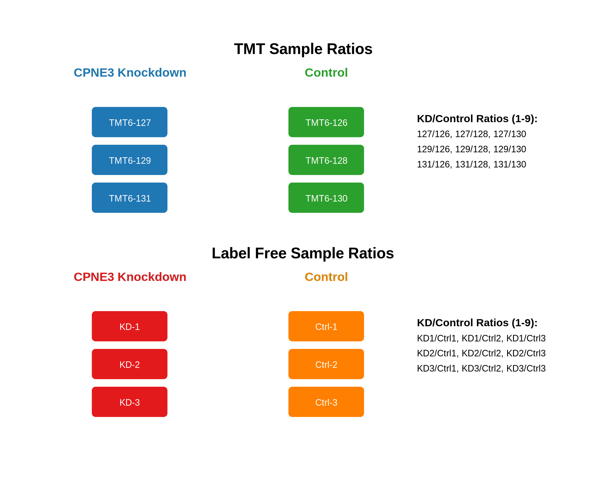
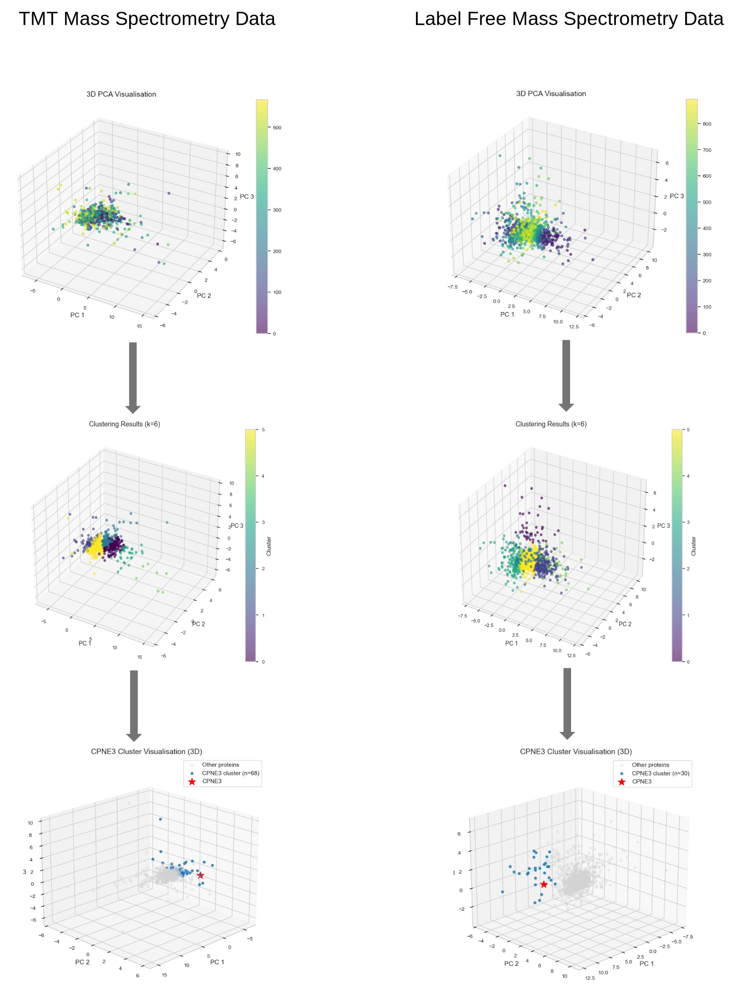

# PCA and K-means Clustering of Mass Spectrometry Data

## Summary
This repository contains the code used for clustering analysis of protein expression changes in CPNE3 knockdown experiments using TMT and Label-free LC-MS/MS data. The analysis identifies proteins with similar expression patterns to CPNE3 in ERBB2-overexpressing C3.6 cells. The final output clusters proteins by expression pattern, enabling identification of the CPNE3-containing cluster for functional enrichment analysis.

## Analysis Features
----------------------------------------------------------------------
* Initial visualisation of protein expression profiles across samples
* Initial 3D PCA visualisation of global protein expression 
* K-means clustering (k=6) to identify protein groups
* CPNE3 cluster highlighting to show co-regulated proteins 
* Cross-validation between TMT and Label-free methods
* Output of cluster assignments for downstream analysis

The protein expression profiles across samples visualised as time series enables:
- Pattern identification of co-regulated proteins
- Quality control of measurements
- Detection of batch effects
- Identification of outliers
- Direct comparison between TMT and Label-free quantification

A protein showing consistent regulation across samples appears as a horizontal line in the time series plot, with the y-axis position indicating up- or down-regulation. High variability manifests as fluctuations from this linear pattern, helping identify robust expression changes. The final clustering results are saved as CSV files with cluster labels for each protein, facilitating further functional analysis of the CPNE3 cluster.

## Repository Contents

`notebooks/`
* TMT_Analysis.ipynb: Analysis pipeline for TMT LC-MS/MS data
* LabelFree_Analysis.ipynb: Analysis pipeline for Label-free LC-MS/MS data

`data/`
* TMT_alldata_log2.csv: Log2-transformed TMT ratios  
* LF_alldata_log2.csv: Log2-transformed Label-free ratios

`diagrams/`
* sample_ratios.svg: Sample organisation and ratio calculation workflow
* analysis_flow.png: PCA and clustering analysis pipeline visualisation

`results/`
* tmt_clustering_results.csv: TMT data clustering output
* LF_clustering_results.csv: Label-free data clustering output

## Sample Organisation

## Analysis Pipeline

## Required Software
1. Python version >= 3.8
2. Required packages:
 - pandas
 - numpy 
 - scikit-learn
 - matplotlib
 - seaborn

## Data Format
Input data requirements:
* CSV format with protein IDs in first column
* 9 ratio columns (log2-transformed KD/Control ratios)
* No missing values

## Usage
1. Clone repository
2. Install dependencies
3. Replace CPNE3 with your protein of interest
4. Follow notebook workflows

## Citation
To be added

## Contact
tendayi.samuriwo.15@ucl.ac.uk
